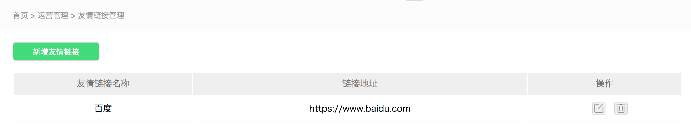

<link rel="stylesheet" href="https://hilightjscdn.oss-cn-hangzhou.aliyuncs.com/highlight/styles/atom-one-dark.css">
<script src="https://hilightjscdn.oss-cn-hangzhou.aliyuncs.com/highlight/highlight.pack.js"></script>
<script>
    hljs.initHighlightingOnLoad();
</script>

# YUKI-Backend-UI
## gulp 使用说明
根目录下面的`gulpfile.js`里面为相关的配置项，
直接在根目录下执行 `gulp`命令，会自动监听html目录下的`sass`目录下的文件到`css`目录下

>命令 `gulp`:

默认执行任务[]：
```js
    gulp.watch('src/*.js', ['es6']);
    gulp.watch('./sass/**/*.scss', ['sass']);
    gulp.watch('./html/sass/*.scss', ['html'])
```
文字说明：
 1. 编译 根目录`sass` 到 根目录`css`
 2. 编译 `html/sass`到`html/css`
 3. 编译 `src/*.js` 到 `build`

> 命令 `gulp minifycss`

压缩 `html/css/*.css` 到 `html/dist/bundle.min.<版本号>.css`
> 命令 `gulp minifyjs`

压缩 `html/js/*.js` 到 `html/dist/bundle.min.<版本号>.js`

> 命令 `gulp jshint`

检查 `html/js/*.js`的语法

> 命令 `gulp html`

手动编译 `html/sass/*.scss`到`html/css/`

> 命令 `gulp sass`

手动编译 根目录下`sass/*.scss`到`css/*.css`

> 命令 `gulp es6`

手动编译 根目录下的 `src/*.js` 到 `build`


> 目录说明
```angular2html
|-- README.md // 说明文档
|-- app.js 
|-- bower.json // bower 依赖
|-- bower_components // bower组件
|-- build //打包的JS文件
|-- css // 后端CSS样式
|-- gulpfile.babel.js
|-- gulpfile.js // gulp 配置文件
|-- html // 移动端的样式
|-- img //图片目录
|-- index.html // 后端index演示页
|-- node_modules
|-- package-lock.json
|-- package.json
|-- sass // 后端SASS的源目录
`-- src // ES 6 目录

```

## 1\. 基本颜色

> 主色

<button style="width:100px;height:30px;background-color:#f2921c;">
</button>

名称                 | 色值      | 预览
:----------------- | :------ | :---------------------------------------------------------------------------
yuki-color-primary(主色 橙色) | #f2921c | <button style="width:100px;height:30px;background-color:#f2921c;">
</button>yuki-color-light-green(主色 淡绿) | #43db7c | <button style="width:100px;height:30px;background-color:#43db7c;">
</button>

> 辅色

名称       | 色值       | 预览
:------- | :------- | :----
yuki-color-light-blue(辅色 淡蓝) | #97c5ff | <button style="width:100px;height:30px;background-color:#97c5ff;">
</button>yuki-color-light-red(辅色 淡红色) | #ff4d4d | <button style="width:100px;height:30px;background-color:#ff4d4d;">
</button>yuki-color-transparent-red(辅色 透明红) | #fff6f6 | <button style="width:100px;height:30px;background-color:#fff6f6;  border:1px solid #ffdcdc;">
</button>

## 2\. 文字字体颜色
名称       | 色值       | 预览
:------- | :------- | :----
yuki-font-color-primary (主色) | #333333 | <button style="width:100px;height:30px;background-color:#333333;">
</button>yuki-font-color-star-gray (星空灰) | #787878 | <button style="width:100px;height:30px;background-color:#787878;">
</button>yuki-font-smoke-gray(烟灰色) | #848484 | <button style="width:100px;height:30px;background-color:#848484;">
</button>yuki-font-light-gray(淡灰色) | #d4d4d4 | <button style="width:100px;height:30px;background-color:#d4d4d4;">
</button>yuki-font-transparent-gray (透明灰) | #fefefe | <button style="width:100px;height:30px;background-color:#fefefe;">
</button>

## 3\.文字字体大小


| 名称    | 值     | 样式预览
| :------------- | :------------- |:-------------
| yuki-font-size-primary       | 14px      | <span style="font-size:14px">默认</span>
| yuki-font-size-small       | 12px      | <span style="font-size:12px">缩小</span>
| yuki-font-size-large       | 16px      | <span style="font-size:16px">放大</span>

## 4. 图标样式部分

<div style="width:18px;height:18px;border:1px solid #333333;background-color:#ffbdf0"></div>

| 名称     | 宽*高    |预览
| :------------- | :------------- |:-------------
| yuki-icon-18-18      | 18-18       | <div style="width:18px;height:18px;border:1px solid #333333;background-color:#ffbdf0"></div>
| yuki-icon-18-22     | 18-22       | <div style="width:18px;height:22px;border:1px solid #333333;background-color:#ffbdf0"></div>
| yuki-icon-16-16     | 16-16       | <div style="width:16px;height:16px;border:1px solid #333333;background-color:#ffbdf0"></div>
| yuki-icon-24-24    | 24-24       | <div style="width:24px;height:24px;border:1px solid #333333;background-color:#ffbdf0"></div>
| yuki-icon-22-22    | 22-22       | <div style="width:22px;height:22px;border:1px solid #333333;background-color:#ffbdf0"></div>
| yuki-icon-14-14    | 14-14     | <div style="width:14px;height:14px;border:1px solid #333333;background-color:#ffbdf0"></div>

## 5\. 按钮样式


| 名称    | 描述     |
| :------------- | :------------- |
| yuki-button-large-primary      | 大按钮      |
| yuki-button-middle-primary     | 中按钮默认      |
| yuki-button-middle-gray    | 中按钮灰色     |
| yuki-icon-button-default     | 图标按钮默认      |

## 6\. 组件

- 分页组件

> html 部分

```
<div class="yuki-component-pagination">
    <div class=" yuki-component-pagination previous">◀上一页</div>
    <div class="yuki-component-pagination current-page">1</div>
    <div class="yuki-component-pagination next">下一页▶</div>
    <span class="yuki-component-pagination count">共999条</span>
    <span class="yuki-component-pagination turn">转第</span>
    <div class="yuki-component-pagination redirect">
        <input class="redirect-value" type="text" title="">
    </div>
    <span class=" yuki-component-pagination page">页</span>
    <div class="yuki-component-pagination ensure-redirect"></div>
</div>
```
复制上面的HTML代码到要使用的部分即可。

- 字体图标

> html部分

```angular2html
<!--字体图标-->
<div class="yuki-icon-button-default">
    <span></span>修改
</div>
```

- 面包屑 弹窗 大按钮 表格
````html
<div class="yuki-brand">
    <div class="yuki-brand-crumbs"><a href="">首页</a> > <a href="">运营管理</a> > <a href="">友情链接管理</a></div>
    <div class="yuki-brand-body">
        <div class="yuki-brand-btnBox">
            <div class="addBrand">新增友情链接</div>
        </div>
        <table class="yuki-brand-table">
            <thead>
            <tr>
                <td>友情链接名称</td>
                <td>链接地址</td>
                <td>操作</td>
            </tr>
            </thead>
            <tbody>
            <tr>
                <td>百度</td>
                <td>https://www.baidu.com</td>
                <td>
                    <span class="yuki-brand-edit yuki-brand-btn"></span>
                    <span class="yuki-brand-delete yuki-brand-btn"></span>
                </td>
            </tr>
            </tbody>
        </table>
        <div class="yuki-brand-pop">
            <div class="yuki-brand-pop-title">添加友情链接</div>
            <div class="yuki-brand-pop-search">
                <div class="yuki-brand-pop-name yuki-brand-pop-searchBox">
                    <div class="yuki-brand-pop-titleName">链接名称:</div>
                    <input class="link-name" type="text" placeholder="请输入链接名称..."/>
                </div>
                <div class="yuki-brand-pop-name yuki-brand-pop-searchBox link-address-margin">
                    <div class="yuki-brand-pop-titleName">链接地址:</div>
                    <input class="link-address" type="text" placeholder="请输入链接地址..."/>
                </div>
            </div>
            <div class="yuki-brand-pop-btn-box">
                <div class="yuki-brand-pop-btn">
                    <div class="yuki-brand-pop-ensure yuki-brand-popBtn">确定</div>
                    <div class="yuki-brand-pop-cancel yuki-brand-popBtn">取消</div>
                </div>
            </div>
        </div>
    </div>
</div>

````

