# YUKI移动端的UI组件库
## doT.js 模板引擎写法
> 条件语句：
```html
{{? it.name }}
<div>Oh, I love your name, {{=it.name}}!</div>
{{?? it.age === 0}}
<div>Guess nobody named you yet!</div>
{{??}}
You are {{=it.age}} and still don't have a name?
{{?}}
```
等于匿名函数：
```javascript
function anonymous(it /*``*/) {
    var out = '';
    if (it.name) {
        out += '<div>Oh, I love your name, ' + (it.name) + '!</div>';
    } else if (it.age === 0) {
        out += '<div>Guess nobody named you yet!</div>';
    } else {
        out += 'You are ' + (it.age) + ' and still don\'t have a name?';
    }
    return out;
}
```


> 遍历部分数据
```html
{{##def.snippet:
<div>{{=it.name}}</div>{{#def.joke}}
#}}

{{#def.snippet}}
```
等价于：

```javascript
    function anonymous(it /*``*/) {
        var out = '';
        for (var prop in it) {
              out += '<div>' + (prop) + '</div>';
          }
          return out;
      }
  ```
  > 插入指定的值
  ````html
<div>Hi {{=it.name}}!</div>
<div>{{=it.age || ''}}</div>
````
等价于：
```javascript
function anonymous(it /*``*/) {
    var out = '<div>Hi ' + (it.name) + '!</div><div>' + (it.age || '') + '</div>';
    return out;
}
```
> 遍历对象数组
```html
{{~it.array :value:index}}
<div>{{=value}}!</div>
{{~}}
```
等价于：
```javascript
function anonymous(it /*``*/) {
    var out = '';
    var arr1 = it.array;
    if (arr1) {
        var value, index = -1, l1 = arr1.length - 1;
        while (index < l1) {
            value = arr1[index += 1];
            out += '<div>' + (value) + '!</div>';
        }
    }
    return out;
}
```
> 高级模板：说明定义和包含。

包含在变量中定义的外部代码段：
```html
{{#def.externalsnippet}}

```
从文件加载外部模板：

```html
{{#def.loadfile('/snippet.txt')}}

```
从文件加载外部模板并缓存在变量中：
```html
{{#def['snippet.txt'] || (def['snippet.txt'] = def.loadfile('/snippet.txt'))}}

```
再次使用缓存文件
```html
{{#def['snippet.txt']}}

```
这是一个将在之后使用的def块。此代码段也可以从外部模板引用：
```html
{{##def.snippet1:
	Some snippet that will be included {{#def.a}} later {{=it.f1}}
#}}
```
首次使用snippet1：
```html
{{#def.snippet1}}

```
第二次使用：
```html
{{#def.snippet1}}

```
包含snippet1如果为true：

```html
{{# true && def.snippet1 }}

```
运行时和编译时间评估一起使用：
```html
{{= it.f3 + {{#def.a + def.b}} }}

```
包含xyz或插入'not found'：
```html
{{#def.xyz || 'not found'}}

```
将xyz设置为1并排除输出结果：

```html
{{##def.xyz=1#}} is identical to {{#(def.xyz=1) && ""}}

```
将xyz与1进行比较，如果为false，则显示“xyz不为1”

 ```html
{{#def.xyz === 1 || 'xyz is not 1'}}
```
```html
{{ if ({{#!def.abc}}) { }}
	{{#def.abc}} is falsy
{{ } }}

{{ if ({{#def.xyz === 1}}) { }}
	if(true) block
{{ } }}

{{##def.fntest = function() {
	return "Function test worked!";
}
#}}

{{#def.fntest()}}

```

条件语句：

```html
{{? !it.altEmail }}
	<p>
	second email: {{= it.altEmail }}
	</p>
{{?? true }}
	else case worked
{{?}}
```
数组迭代：
```html
{{~ it.farray :p }}
	<h1>{{=p.farray}}<h1>
	{{~ p.farray :value:i }}
		<h2>{{=i}}: {{=value}}</h2>
		{{~ value :w }}
			<h3>{{=w}}</h3>
		{{~}}
	{{~}}
{{~}}
```
```html
{{~ ["apple", "banana", "orange"] :k}}
	{{=k}}
{{~}}

```
```html
{{~ (function(){ return [1,2,3]})() :k}}
	{{=k}}
{{~}}
```
```html
{{ function children(it) { }}
{{?it.Nodes.length}}
<ul>
    {{~ it.Nodes :p}}
    <li>
        {{=p.title}}
		{{children(p);}}
    </li>
    {{~}}
</ul>
{{?}}
{{ } }}
```
```html
{{ children( {Nodes:[ {title:"1.1", Nodes:[ {title:"1.1.1", Nodes:[]}, {title:"1.1.2", Nodes:[]}] }, { title:"1.2", Nodes:[]}, { title:"1.3", Nodes:[]}], title:"1" } ); }}

```

```html
{{##def.block:param:
	<div>{{=param}}</div>
#}}

{{##def.block1:param:
	<div>{{=param.a}}</div>
#}}

```
```html
{{#(def.block:'text' || '') + def.block:5}}

{{#def.block:it.f3 || ''}}

{{#def.block:"lala tralala" || ''}}

{{#def.block1:{a:1, b:2} || ''}}

{{##def.testFunctionWithParam = function(str) {
		return "My name is: " + str;
	}
#}}
```

```html
{{##def.mytestparam: {{=it.name}} #}}
{{#def.testFunctionWithParam(def.mytestparam)}}

{{#def.testFunctionWithParam("\{\{=it.name\}\}")}}

{{##def.testParamDef:myparam:
My name is: {{=myparam}}
#}}
```
```html
{{#def.testParamDef:it.name}}
```
END
## 工具使用流程

> 注意：

请执行 `npm isntall` 或者 `cnpm install `


1. 编写SASS文件以及新增加文件，请使用或者重启`gulp`

2. 移动端的所有`JS`统一放在 `html/js`

3. `scss` 文件 统一放在 `html/sass`

4. 编译打包的`css` 文件为 `html/dist/bundle.min.css`,编译打包的`js`文件为`html/dist/bundile.min.js` 

5. 替换打包好的`bundle.min.css|js`

请在html文件中引用如下的JS：
> `tpl.html` 中

```html
    <script src="dist/bundle.min.js"></script>
    <link rel="stylesheet" href="dist/bundle.min.css">
```
> 运行  `gulp replace`,html文件被替换为

```html
    <script src="dist/bundle-aa8c8b8910.min.js"></script>
    <link rel="stylesheet" href="dist/bundle-6032bd37b1.min.css">
```


## CSS 样式命名规范：
1. 文件命名全部小写
2. 对于不同文件模块CSS样式，需要按照当前文件名称为依据

例如： 创建名称为 a.css 的文件，那么 对应的CSS样式需要按照文件名称a作为前缀，
例如：

```html
a-header{}

a-footer{}

```
3. 对应文件名称不能覆盖index.css的基础样式，
例如：

```html
header{}

footer{}
```
## HTMl 样式命名规范：


1. 页面基本模板
```html
<!DOCTYPE html>
<html lang="en">

<head>
    <meta charset="utf-8">
    <meta content="yes" name="apple-mobile-web-app-capable">
    <meta content="yes" name="apple-touch-fullscreen">
    <meta content="telephone=no,email=no" name="format-detection">
    <meta name="viewport" content="maximum-scale=1.0,minimum-scale=1.0,user-scalable=0,width=device-width,initial-scale=1.0"/>
    <meta name="format-detection" content="telephone=no,email=no,date=no,address=no">
    <link rel="apple-touch-icon" href="http://yukicomic-pic.oss-cn-hangzhou.aliyuncs.com/yukiicon/favicon.ico">
    <link rel="Shortcut Icon" href="http://yukicomic-pic.oss-cn-hangzhou.aliyuncs.com/yukiicon/favicon.ico" type="image/x-icon">
    <link rel="stylesheet" href="css/index.css">
    <title>模板页面</title>
</head>

<body>
    <header>
    </header>
    <main>
        <div class="popupBox">
            <div class="popupBoxBody">
                <div class="popupBox-closeBtn"></div>
                <div class="popupBox-ensureBtn">确定</div>
            </div>
        </div>
    </main>
    <footer>
    </footer>
    <script src="js/zepto.min.js"></script>
</body>

</html>
```
2. 禁止的自动识别

```html
<meta name="format-detection" content="telephone=no,email=no,date=no,address=no">
  
```
3. 禁止缩放
```html
    <meta name="viewport" content="maximum-scale=1.0,minimum-scale=1.0,user-scalable=0,width=device-width,initial-scale=1.0"/>
```

> 目录说明

````angular2html
|-- README.md // 说明文档
|-- css // 打包好的CSS样式
|-- flexible.html //组件详情显示页
|-- img // 需要的图片资源
`-- sass // SASS 源文件
````    
  ##组件：
  
  - 通用按钮 默认
  ```html
  <div class="button-primary">保存</div>
  ```
  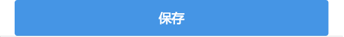
  
  - 页脚导航
  ```html
<div class="footer-bar">
    <div class="footer-bar-item">
        <div class="icon-1"></div>
        <span class="info-1">福利仓</span>
    </div>
    <div class="footer-bar-item">
        <div class="icon-2"></div>
        <span class="info-2">分类</span>
    </div>
    <div class="footer-bar-item">
        <div class="icon-3"></div>
        <span class="info-3">购物袋</span>
    </div>
    <div class="footer-bar-item">
        <div class="icon-4"></div>
        <span class="info-4">我的</span>
    </div>

</div>
```
  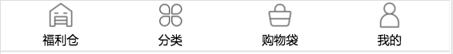

- 头部导航 默认

```html
<div class="header-nav">
    <div class="header-nav-button-left">
        <div class="icon-left"></div>
        <span class="info-left">分类</span>
    </div>
    <div class="search-input">
        <div class="search-icon"></div>
        <div class="search">
            <input class="to-search" type="text" placeholder="日本进口面膜">
        </div>
    </div>
    <div class="header-nav-button-right">
        <div class="icon-left"></div>
        <span class="info-left">消息</span>
    </div>
</div>
```
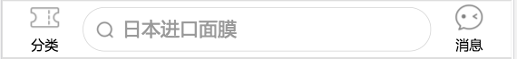

- 头部标签导航
```html
<div class="header-tab-nav">
    <div class="tab-nav-item-1">
        推荐
    </div>
    <div class="tab-nav-item-2">
        美妆
    </div>
    <div class="tab-nav-item-3">
        数码
    </div>
    <div class="tab-nav-item-4">
        生活
    </div>
    <div class="tab-nav-item-5">
        穿搭
    </div>
    <div class="tab-nav-item-6">
        学习
    </div>
</div>
```
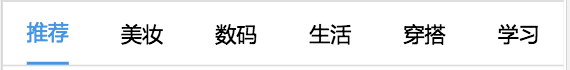

- 头部搜索带取消
```html
<div class="header-nav-with-cancel">
    <div class="search-input">
        <div class="search-icon"></div>
        <div class="search">
            <input class="to-search" type="text" placeholder="日本进口面膜">
        </div>
    </div>
    <div class="cancel">取消</div>
</div>
```
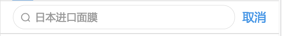

- 新品推荐
```html
<div class="header-nav-recommend">
    <div class="nav-icon"></div>
    <div class="recommend">新品推荐</div>
</div>
```
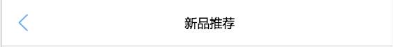

- 搜索带返回
```html
<div class="header-nav-search-back">
    <div class="nav-icon"></div>
    <div class="search-input">
        <div class="search-icon"></div>
        <div class="search">
            <input class="to-search" type="text" placeholder="音响">
        </div>
    </div>
</div>
```
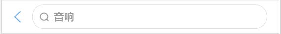

- 唯一搜索
```html
<div class="header-nav-only-search">
    <div class="search-input">
        <div class="search-icon"></div>
        <div class="search">
            <input class="to-search" type="text" placeholder="从这里出发你会发现更多">
        </div>
    </div>
</div>

```
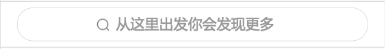

- 商品分类切换标签
```html
<div class="goods-tab-nav">
    <div class="tab-nav-item-1">
        萌宅小物
    </div>
    <div class="tab-nav-item-2">
        抱枕
    </div>
    <div class="tab-nav-item-3">
        公仔
    </div>
    <div class="tab-nav-item-4">
        手机壳
    </div>
    <div class="tab-nav-item-5">
        鼠标垫
    </div>
</div>

```
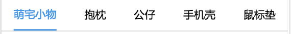

- 生活
```html
<div class="header-nav-life">
    <div class="nav-icon"></div>
    <div class="title">生活</div>
    <div class="right-nav-icon"></div>
</div>


```
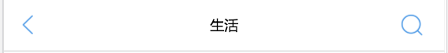

- 购物袋
```html
<div class="header-nav-buy-bag">
    <div class="left-nav-icon"></div>
    <div class="title">购物袋</div>
    <div class="cancel">取消</div>
</div>
```
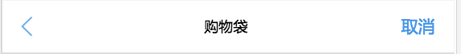

- 订单分类
```html
<div class="order-tab-nav">
    <div class="tab-nav-item-1">
        全部
    </div>
    <div class="tab-nav-item-2">
        待付款
    </div>
    <div class="tab-nav-item-3">
        待发货
    </div>
    <div class="tab-nav-item-4">
        待收货
    </div>
    <div class="tab-nav-item-5">
        待评价
    </div>
</div>

```
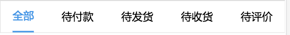

- 商品详情列表
```html
<!--商品列表展示-->
<div class="goods-show">
    <div class="goods-item">
        <div class="goods-picture">1</div>
        <div class="goods-title">这里是商品标题,这里是商品标题，这里是商品标题</div>
        <div class="goods-price">￥34822</div>
    </div>
    <div class="goods-item">
        <div class="goods-picture">2</div>
        <div class="goods-title">这里是商品标题,这里是商品标题，这里是商品标题</div>
        <div class="goods-price">￥34822</div>
    </div>
</div>
<!--商品列表展示-->
<div class="goods-show">
    <div class="goods-item">
        <div class="goods-picture">3</div>
        <div class="goods-title">这里是商品标题,这里是商品标题，这里是商品标题</div>
        <div class="goods-price">￥34822</div>
    </div>
    <div class="goods-item">
        <div class="goods-picture">4</div>
        <div class="goods-title">这里是商品标题,这里是商品标题，这里是商品标题</div>
        <div class="goods-price">￥34822</div>
    </div>
</div>
```
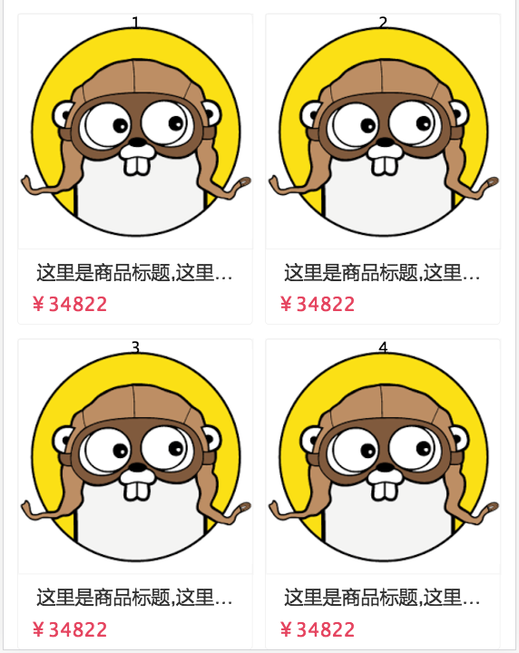

## 移动端reset样式
```angular2html
body,h1,h2,h3,h4,h5,h6,hr,p,blockquote,dl,dt,dd,ul,ol,li,pre,figcaption,figure,fieldset,legend,button,input,textarea,th,td{margin:0;padding:0}
body,button,input,select,textarea{font:12px/1 Lucida Grande,'Microsoft YaHei',"Lucida Grande","Lucida Sans Unicode",Helvetica,Arial,Verdana,sans-serif}
h1{font-size:18px;font-weight:normal}
h2{font-size:16px;font-weight:normal}
h3{font-size:14px;font-weight:normal}
h4,h5,h6{font-size:100%;font-weight:normal}
address,cite,dfn,em,var{font-style:normal}
code,kbd,pre,samp,tt{font-family:"Courier New",Courier,monospace}
small{font-size:12px}
ul,ol,li{list-style:none}
a{text-decoration:none}
abbr[title],acronym[title]{border-bottom:1px dotted;cursor:help}
q:before,q:after{content:''}
legend{color:#000}
fieldset,img{border:0}
table{border-collapse:collapse;border-spacing:0}
hr{border:0;height:1px}
*{-ms-word-break:break-all;word-break:break-all;-ms-word-wrap:break-word;word-wrap:break-word;-webkit-tap-highlight-color:rgba(0,0,0,0)}
```
> 引用：
http://www.imuum.com/share-a-custom-mobile-page-development-css-reset.html

